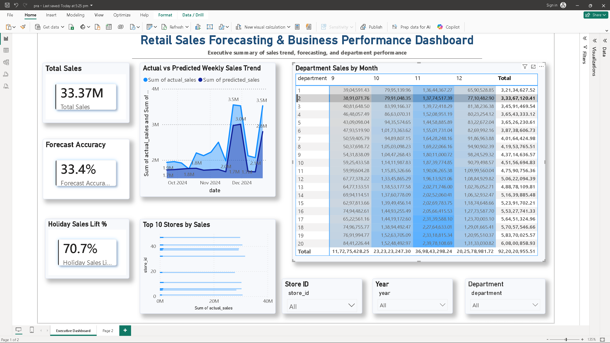

# Retail Sales Intelligence: End-to-End Analytics, Forecasting & Power BI Dashboard

## Project Overview
This project is an end-to-end retail analytics solution built using Python, SQL, XGBoost, and Power BI.  
It combines data cleaning, business analysis, forecasting, and dashboarding to understand weekly sales patterns across stores and departments.

---

## Business Objective
The goal of this project was to:
- analyze retail store sales performance
- identify top-performing stores, departments, and regions
- measure the impact of holidays and markdowns on sales
- build a weekly sales forecasting pipeline
- create an executive dashboard for decision-making

---

## Tools & Technologies
- **Python**
- **Pandas**
- **NumPy**
- **SQL / pandasql**
- **Matplotlib**
- **Seaborn**
- **XGBoost**
- **Power BI**
- **Google Colab**

---

## Dataset Files
The project uses 3 datasets:

1. **sales.csv**  
   Contains store-level weekly sales by department

2. **stores.csv**  
   Contains store type, size, and region information

3. **features.csv**  
   Contains external variables such as temperature, fuel price, markdowns, CPI, unemployment, holidays, and seasonality

---

## Project Workflow
### 1. Data Loading
- Uploaded and loaded 3 CSV files in Google Colab
- Checked shape, schema, null values, and sample rows

### 2. Data Cleaning and Merging
- Filled missing holiday labels
- Converted date columns to datetime
- Merged all files into a master dataframe

### 3. SQL Business Analysis
Performed 10 SQL analyses including:
- Top 5 stores by revenue
- Store type comparison
- Holiday vs non-holiday sales
- Top departments
- Region performance
- Monthly sales trend
- Markdown impact
- Declining stores
- Unemployment impact
- Holiday uplift by department

### 4. Exploratory Data Analysis
Created 12 visualizations to study:
- sales trend
- region and store performance
- markdown effects
- seasonality
- department performance
- economic indicators

### 5. Feature Engineering
Created features such as:
- week number, month, quarter, year
- lag sales
- rolling averages
- days since holiday
- store size category
- markdown intensity flags

### 6. Forecasting
- Built an XGBoost model using a time-based split
- Evaluated performance using MAE, RMSE, R², WAPE, and SMAPE
- Treated forecasting as a decision-support layer due to retail volatility

### 7. Dashboarding
Built a Power BI dashboard with:
- Total Sales KPI
- Forecast Accuracy KPI
- Holiday Sales Lift KPI
- Actual vs Predicted Sales Trend
- Top Stores by Sales
- Department Sales by Month
- Interactive slicers

---

## Key Business Insights
- Type A stores generated significantly higher average weekly sales than Type C stores
- Holiday weeks showed strong sales uplift compared to non-holiday weeks
- East region outperformed West region
- Top 5 stores contributed a large share of overall revenue
- Department 20 showed the highest holiday uplift
- Markdown-linked promotions showed measurable business impact

---

## Monetized Opportunities
- Upgrading 5 Type C stores toward Type A performance could unlock **~₹1.66 Cr annual uplift**
- Better festive planning across 50 stores could unlock **~₹3.16 Cr**
- Improving West-region execution could unlock additional regional revenue upside
- Focused promotion on high-lift departments could create strong festive revenue gains

---

## Model Performance
### Improved XGBoost Model
- **MAE:** ₹28,821.77
- **RMSE:** ₹38,350.39
- **R²:** 0.4636
- **WAPE:** 43.76%
- **SMAPE:** 49.23%

### Interpretation
The model captured store structure, holiday effects, and recent sales trends, but forecasting remained moderately accurate due to high retail demand volatility and cross-store heterogeneity.

---

## Dashboard Preview

---

## Repository Files
- `retail_sales_project.ipynb` → complete notebook workflow
- `retail_sales_dashboard.pbix` → Power BI dashboard file
- `dashboard_screenshot.png` → dashboard preview
- `sales.csv`, `stores.csv`, `features.csv` → raw datasets
- `requirements.txt` → Python dependencies

---

## What I Learned
- How to clean and merge multi-source retail datasets
- How to derive business insights using SQL and EDA
- How to build time-aware forecasting pipelines
- How to convert analysis into dashboard-ready storytelling
- How to present business recommendations using data

---

## Author
**Prakash Pathak**  
Aspiring Data Analyst / Data Scientist  
Built as a portfolio project for interview preparation.
